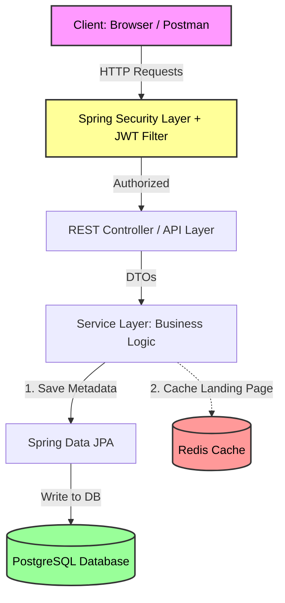
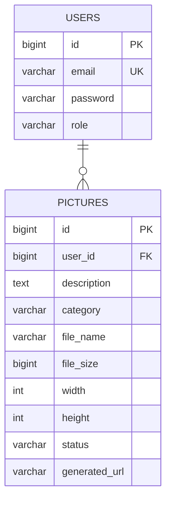

# Picture-publishing-service
Pictures Publishing Service built with Spring Boot and PostgreSQL, featuring JWT-based authentication, high-performance caching with Redis, and database versioning using Liquibase. The project follows feature-based architecture.

---

## 🛠 Tech Stack

| Category | Technology |
| :--- | :--- |
| **Framework** | Spring Boot 3.x, Java 17+ |
| **Database** | PostgreSQL |
| **Caching** | Redis |
| **Security** | Spring Security, JWT |
| **Database Migration** | Liquibase |
| **Build Tool** | Maven |

---

## 🏗️ System Architecture & Data Model

### 1. High-Level Architecture Diagram
This diagram illustrates the request flow, security filtering, business logic processing, caching strategy, and database persistence.


### 2. Entity Relationship Diagram (ERD)
The database structure consists of two main tables with a One-to-Many relationship between Users and Pictures, strictly managed via Liquibase migrations.

---
## ⚙️ Prerequisites
Ensure you have the following installed on your machine:

Java 17 or higher

Docker (to run PostgreSQL and Redis containers)

Maven

🚀 How to Run
---
Start Infrastructure:
Use Docker Compose to launch the database and cache containers:
```
docker-compose up -d
```
---
### Check Swagger for API Documentation
